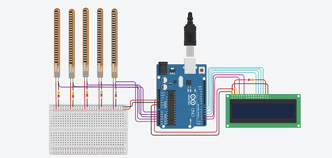
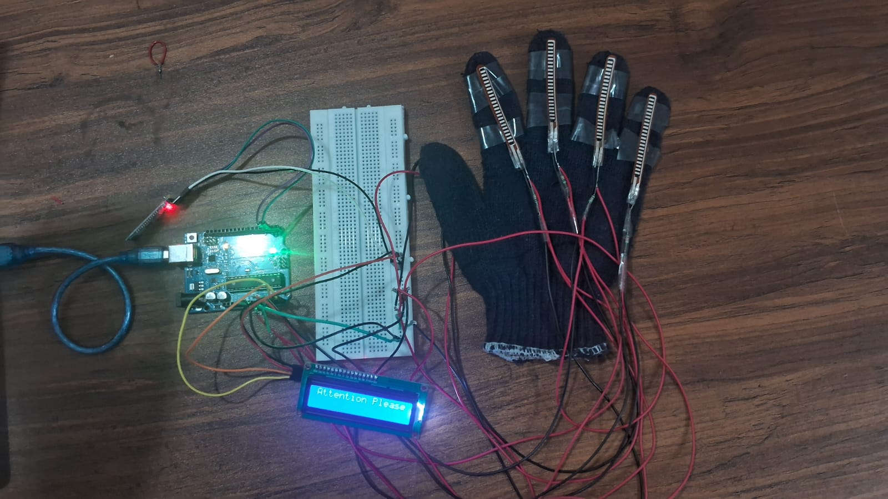

# Sign Language Glove Using Arduino

## Overview

The Sign Language Glove is an assistive technology project designed to help bridge communication gaps between individuals with hearing and speech impairments and those unfamiliar with sign language. The system converts hand gestures into text and voice output in real time.

## Problem Statement

Communication between sign language users and non-sign language users can be challenging in everyday situations. This project aims to provide an affordable and portable solution for translating hand gestures into understandable text and speech.

## Objectives

* Recognize hand gestures using flex sensors.
* Convert gestures into readable text.
* Generate voice output for effective communication.
* Develop a low-cost and portable assistive device.

## Components Used

* Arduino Uno
* Flex Sensors
* LCD Display
* Bluetooth Module
* Jumper Wires
* Power Supply

## Working Principle

Flex sensors attached to the glove detect finger movements. The Arduino Uno processes the sensor readings and maps them to predefined gestures. The recognized gesture is displayed as text on an LCD screen and transmitted via Bluetooth for voice output on a mobile device.

## Images

### Simulation

### Hardware

## Project Demonstration

🎥 Hardware Demonstration Video

[Watch Hardware Demonstration](images/hardware.mp4)

## Features

* Real-time gesture recognition
* Text output display
* Voice output through Bluetooth
* Portable and user-friendly design
* Cost-effective implementation

## Applications

* Assistive communication
* Educational institutions
* Healthcare support systems
* Accessibility solutions

## Future Enhancements

* Machine Learning-based gesture recognition
* Multi-language support
* Mobile application integration
* Expanded gesture vocabulary
* Cloud-based communication system

